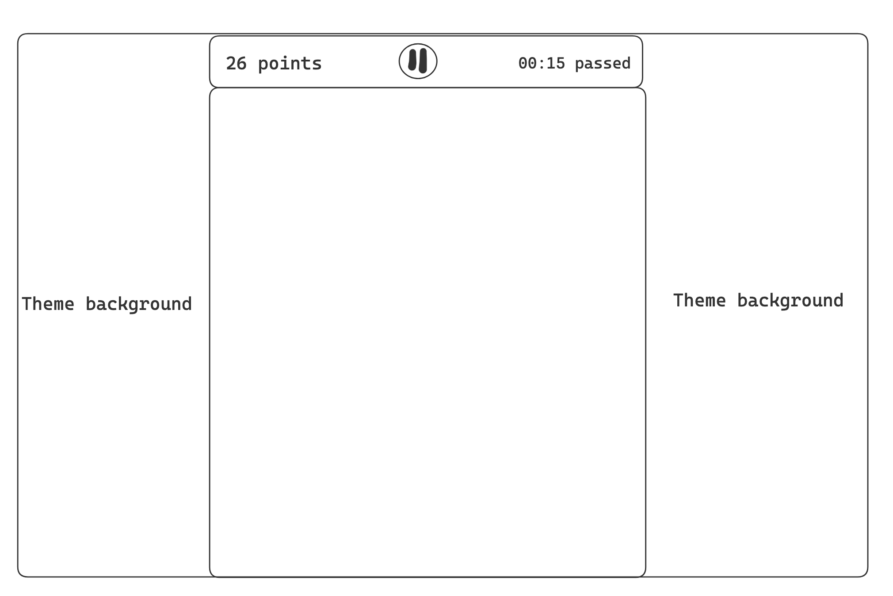

# Snake game to-do list

- [x] Make the snake grow when it eats the fruit
- [x] Make the player lose when the snake eats itself
- [x] (Bug) The snake shouldn't be able to turn around
- [x] (Bug) The fruit should not appear on the snake
- [x] Add a counter of many fruits you have eaten
- [x] Add a timer to show how much time has passed since the game started
- [x] Make the game prettier
- [x] Implement a proper game interface
- [x] Add difficulty levels?
- [x] Add game rules page
- [x] Add a leaderboard
- [x] Add multiple fruits at once
- [x] Sort leaderboard records
- [x] Different game modes
- [x] Make the fruits different somehow for a more interesting gameplay
- [x] Fix the snake's head showing up as a square
- [x] (Bug) Make the snake start with length at least 3 (head + body + tail)
- [x] (Bug) Snake should not move right at the start of the game
- [x] Make board size customisable and also add an option to make the board cyclic
- [x] When the board size is getting too big, reduce the cell size instead
- [x] (Bug) When you click on two move buttons in the same frame, you could lose on the spot
- [x] On the difficulty selection screen, add toggles for board size and board wrap
- [ ] Coins can appear on the field
- [ ] Perks: speed booster, x2 score multiplier, freeze mode (?)
- [ ] Snake skins
- [ ] Coins for buying skins
- [ ] Add a carousel for the game rules page and add accompanying visuals
- [ ] Think about updating the leaderboard to show the board size/board wrap/difficulty values (consider an accordion)
- [ ] Consider adding music for a snake game
- [ ] Consider a new game interface
- [ ] Add a "About" section or put links to reach out
- [ ] Design campaign levels with walls and other stuff?
- [ ] Consider migration to Vite vanilla template

# Homework

Try to implement the new game interface. Doesn't have to be perfect, but it is nice to get started somewhere.

# How String.split() works

# Game interface idea

